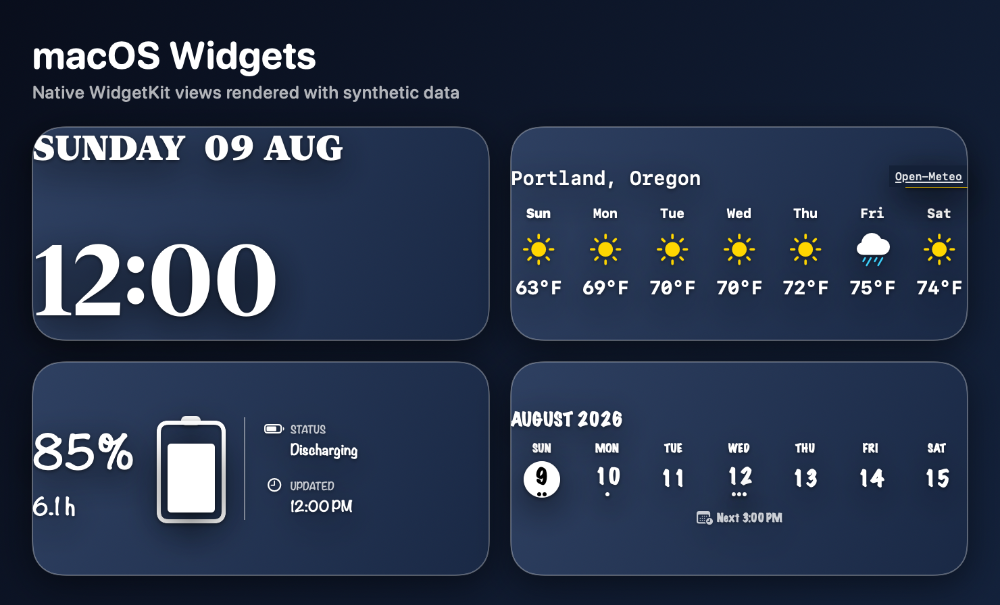
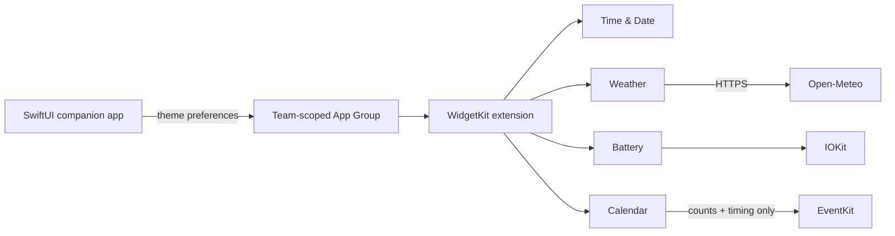

# macOS Widgets

[](https://github.com/joshuawyadao/MacOS-Widgets/actions/workflows/ci.yml)
[](https://www.apple.com/macos/)
[](https://www.swift.org/)
[](LICENSE)

A native SwiftUI companion app and WidgetKit extension for four configurable desktop widgets: **Time & Date**, **Weather**, **Battery**, and **Calendar**. The project favors local data, explicit permissions, accessible presentation, and free Personal Team builds over subscriptions or a hosted backend.

> **Project status:** Source-first personal project. Build locally with Xcode and a free Apple Personal Team; no pre-signed binary is distributed.



> The showcase is generated from the real SwiftUI widget views using deterministic synthetic weather, battery, and calendar data. It contains no personal device or account data.

## What it includes

| Widget | Capabilities | Data source |
| --- | --- | --- |
| Time & Date | Layout, date/time formatting, typography, and an optional labeled second time zone | Foundation and system locale |
| Weather | Searchable city, unit selection, seven-day forecast, comfort, UV, wind, precipitation, sunrise, and sunset presets | Open-Meteo forecast and geocoding APIs |
| Battery | Charge, power state, estimate, update time, health, and cycle diagnostics | Local IOKit power sources |
| Calendar | Automatic Day/Week/Month layouts, navigation, event indicators, and optional next-event timing | Local EventKit access |

The companion app adds a shared typography system with six curated themes, per-widget overrides, live previews, and one coordinated WidgetKit reload.

## Engineering highlights

- **Native macOS architecture:** one SwiftUI host app, one WidgetKit extension, App Intents configuration, and shared modules compiled into both targets.
- **Privacy-aware Calendar modeling:** EventKit objects are reduced to counts and optional timing intervals before they reach widget presentation. Titles, notes, locations, attendees, and calendar names are never placed in widget models.
- **Resilient weather delivery:** HTTPS requests use a keyless API, bounded timeouts, normalized decoding, retry-aware failures, and a hashed local cache capped at 12 recent city/unit forecasts.
- **Hardware normalization:** IOKit and AppleSmartBattery values are converted into stable display models with explicit unavailable states and bounded health calculations.
- **Configuration compatibility:** string-backed options, stable widget identities, and defaults preserve existing widget instances as features evolve.
- **Verification as a product contract:** behavior tests, rendering smoke tests, Release compilation, embedded-extension checks, App Intents metadata validation, privacy strings, entitlements, and coverage reporting run through one command.

## Architecture



```text
DesktopWidgetsApp/        Companion app, onboarding, settings, and permission flows
DesktopWidgetsExtension/  Widget bundle and four independent widget modules
Shared/                   Models, styling, and utilities shared by both targets
DesktopWidgetsTests/      Behavior, contract, and rendering smoke tests
Scripts/                  Personal Team setup, runtime refresh, and verification
docs/                     Widget and design-system documentation
```

## Friendly personal installation

Weather's searchable City control needs a registered development identity, and shared appearance preferences need the same signed App Group on the app and widget extension. An ad-hoc **Sign to Run Locally** build is not sufficient.

Apple’s current macOS capability table lists App Groups and App Sandbox for no-cost Apple Developer accounts, but this repository does not treat documentation alone as proof that a particular Personal Team works. `Install Desktop Widgets.command` builds with Xcode automatic provisioning and refuses to install unless the app and extension have valid Apple Development signatures from the selected team and contain the complete required sandbox, App Group, Calendar, and extension-network entitlement contract. If Xcode embeds provisioning profiles, they must also grant the expected Team ID and App Group. Xcode 26.6 may validly omit profiles for this macOS entitlement set. See [Personal Team installation](docs/Personal-Team-Installation.md) for the feasibility evidence and signed validation results.

For a non-developer, start with [Installation Guide.md](Installation%20Guide.md):

1. Install and open full Xcode once.
2. Add an Apple Account in **Xcode → Settings → Accounts**.
3. Double-click **Install Desktop Widgets.command**. It discovers the free Personal Team, writes private ignored settings, builds, installs to `~/Applications/Desktop Widgets.app`, registers the widget, and opens the app. Press Return to accept the recommended low-resource automatic maintenance.
4. Control-click the desktop, choose **Edit Widgets**, and place the desired widgets. macOS requires user placement; the app cannot arrange the desktop.
5. Automatic maintenance briefly checks at login and once daily. It normally does nothing until the final 48 hours of the profile expiration or a conservative seven-day profile-free signing window, then runs the same guarded refresh at low priority. It has no `KeepAlive` process and successful runs are quiet.
6. If macOS reports that attention is needed, open Xcode to complete any requested sign-in or 2FA step, then double-click **Refresh Desktop Widgets.command**. Repeated runs reuse stable identifiers and the same safe destination.

The installer never requests, prints, or stores an Apple password or authentication token. It writes bounded redacted logs under `~/Library/Logs/Desktop Widgets`, keeps its reusable source under `~/Library/Application Support/Desktop Widgets/Installer`, and uses the existing guarded runtime refresh that never unregisters unrelated extensions. **Enable Automatic Refresh.command** and **Disable Automatic Refresh.command** safely control only Desktop Widgets' own user schedule; the manual refresher always remains available.

Run **Package Desktop Widgets for Another Mac.command** to create a clean handoff ZIP without Git history, build products, local signing settings, certificates, profiles, or logs. A future paid Developer ID/notarization route is documented separately in [Paid distribution path](docs/Paid-Distribution-Path.md); it is not implemented or required here.

Existing Time & Date, Battery, and Calendar widget identities and configurations remain compatible. The Weather build-15 identity still requires replacing only older build-14 Weather copies. Appearance themes, App Intent schemas, per-widget options, and existing placed widgets remain unchanged whenever macOS can preserve them under the stable local bundle identifiers.

## Privacy and security

- Calendar access is optional and requested explicitly by the companion app.
- Calendar event text does not enter widget models or views.
- Weather sends a user-selected city search and coordinate to Open-Meteo; it does not request device location.
- Weather is the only widget module with outbound network behavior.
- The app and extension use App Sandbox and narrowly scoped entitlements.
- Account-specific signing values, certificates, provisioning profiles, and local configuration are excluded from Git.

See [Calendar privacy details](docs/Calendar-Widget.md#event-indicators-next-event-timing-and-permission) and [Weather data and privacy](docs/Weather-Widget.md#privacy) for the complete behavior.

## Build locally

### Requirements

- macOS 14 or later
- Xcode 16 or later with a macOS 14+ SDK (validated with Xcode 26.6)
- A free Apple Account added under **Xcode → Settings → Accounts**
- An **Apple Development** certificate created through **Manage Certificates**

### Setup

```sh
git clone https://github.com/joshuawyadao/MacOS-Widgets.git
cd MacOS-Widgets
./Scripts/configure-personal-team.sh
open DesktopWidgets.xcodeproj
```

In Xcode, select **My Mac** and run the `DesktopWidgets` scheme. The local helper stores the detected Team ID only in ignored `Local.xcconfig`; never commit that file. The Run scheme refreshes stale development registrations before opening the companion app.

Then control-click the desktop, choose **Edit Widgets**, search for **Desktop Widgets**, and add any of the four widgets.

Free Personal Team provisioning is intended for local development and may require periodic rebuilding. Dependable direct-download distribution or notarization requires the paid Apple Developer Program.

## Verification

Run the complete local gate before committing:

```sh
./Scripts/verify-widgets.sh
```

The script:

1. Tests the safe runtime-refresh and Personal Team configuration contracts.
2. Runs the complete `DesktopWidgetsTests` suite with code coverage.
3. Builds a fresh unsigned Release app and embedded widget extension.
4. Verifies widget identities, App Intents schemas, sandbox entitlements, privacy strings, shared App Group metadata, and key configuration fields.

GitHub-hosted macOS verification runs for non-draft pull requests and manual dispatches. Draft pull requests do not reserve a macOS runner; marking one ready for review starts the complete test, coverage, and Release-build gate. A newer update to the same pull request cancels superseded work, and merging does not repeat the same full suite on `main`. Use the Actions tab's manual **CI Verify** dispatch whenever a hosted rerun is needed.

Regenerate the privacy-safe README showcase after a relevant visual change:

```sh
./Scripts/generate-portfolio-preview.sh
```

The generator runs the focused rendering test, writes build intermediates to temporary storage, and only replaces `docs/images/widgets-preview.png` and the 1280 × 640 `docs/images/widgets-social-preview.jpg` after the test succeeds. The JPEG stays below GitHub's 1 MB social-preview upload limit.

## Documentation

- [Widget design system](docs/Widget-Design-System.md)
- [Time & Date widget](docs/Time-And-Date-Widget.md)
- [Weather widget](docs/Weather-Widget.md)
- [Battery widget](docs/Battery-Widget.md)
- [Calendar widget](docs/Calendar-Widget.md)

## Contributing

Issues and pull requests are welcome. Read [CONTRIBUTING.md](CONTRIBUTING.md) and
the [Code of Conduct](CODE_OF_CONDUCT.md) before participating. Report conduct
concerns through the private channel in the
[Code of Conduct](CODE_OF_CONDUCT.md#enforcement). Follow the
[Security Policy](SECURITY.md#reporting-a-vulnerability) for vulnerabilities:
never publish exploit or sensitive details, but if private vulnerability
reporting is unavailable, a sanitized public issue may request a private contact
channel.

## License

Released under the [MIT License](LICENSE).

Weather data is provided by [Open-Meteo](https://open-meteo.com/) under [CC BY 4.0](https://creativecommons.org/licenses/by/4.0/); its geocoding data incorporates [GeoNames](https://www.geonames.org/).
