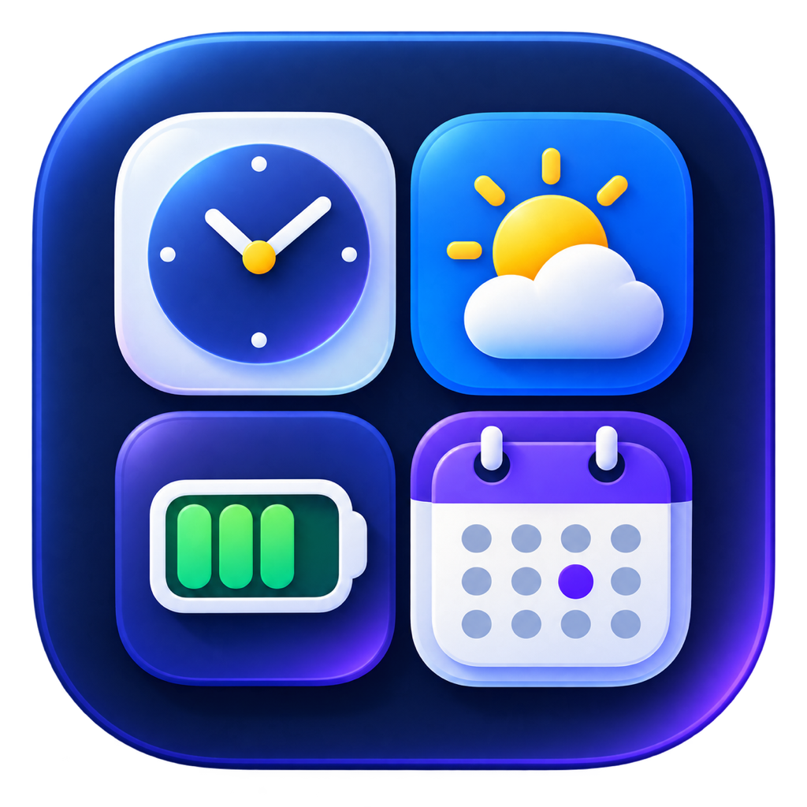
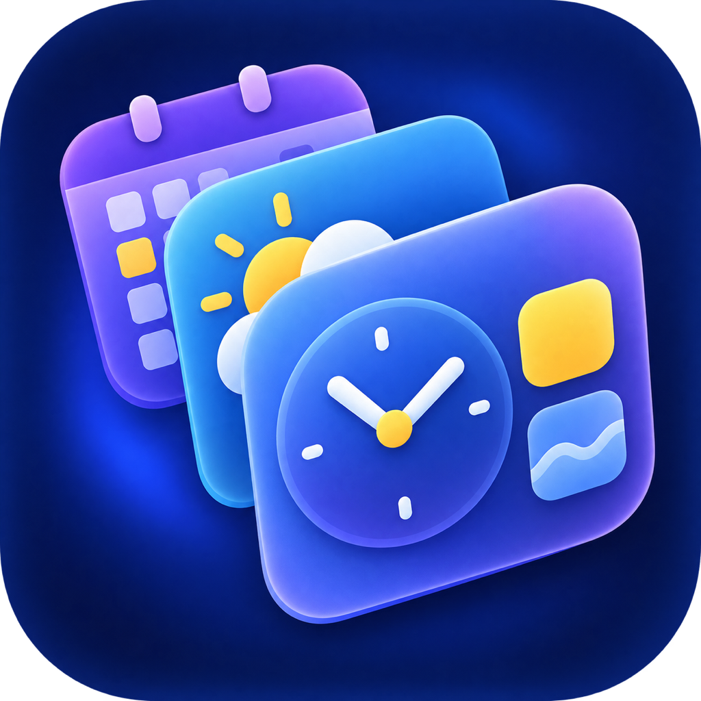
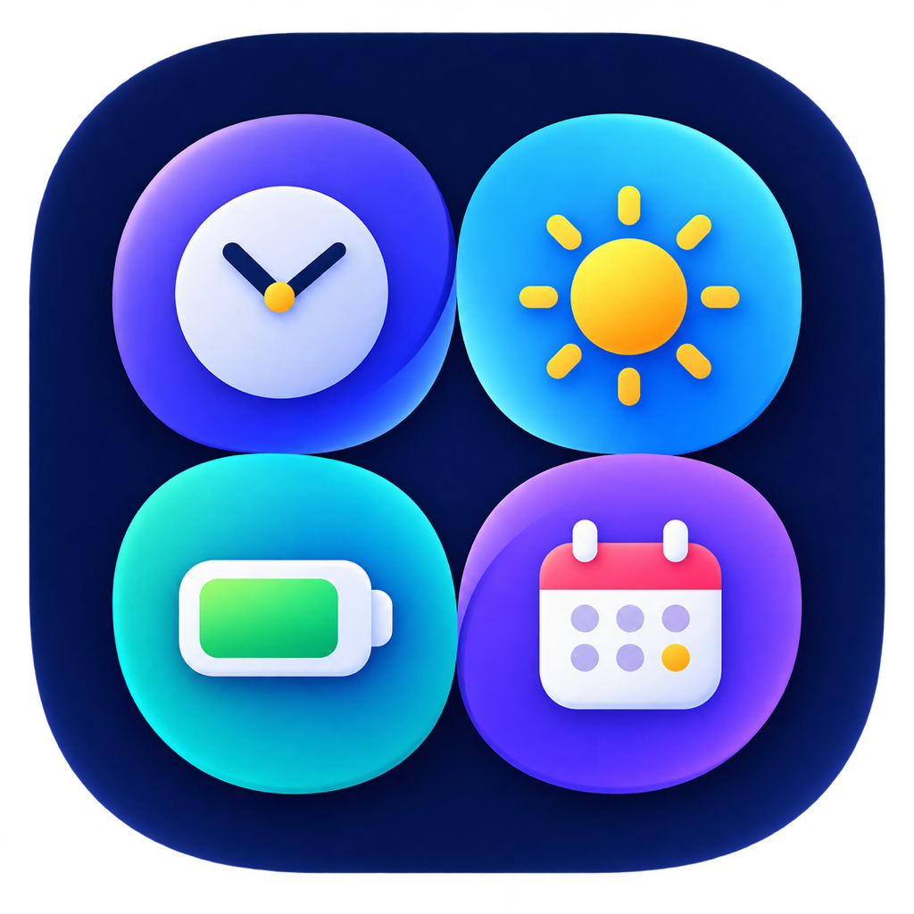
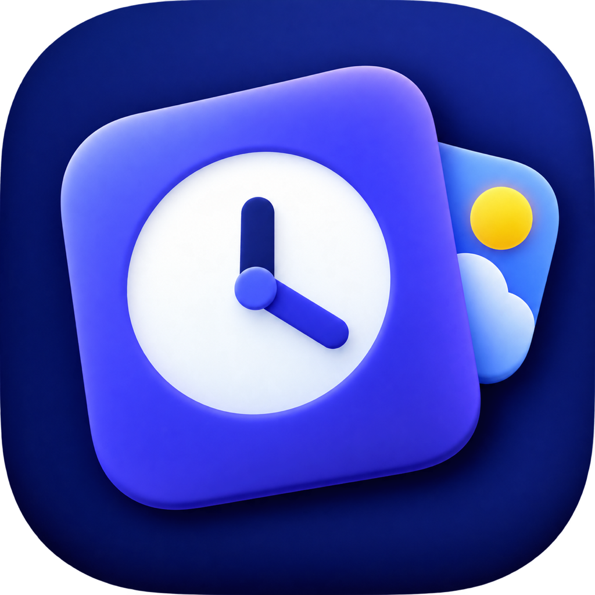

# App Icon Concepts

Desktop Widgets originally had no companion-app asset catalog or configured app-icon set. The existing `DesktopWidgetsExtension/Resources/Assets.xcassets` catalog belongs only to the widget extension, so the companion app previously had no icon to contribute when macOS listed its widgets.

This document records four review concepts generated on September 3, 2026. **02 — Layered Dashboard** was selected for production and now supplies the app target's complete macOS icon set. The other files remain review artifacts rather than compiled resources.

## Concepts

| Concept | Preview | Best quality | Tradeoff |
| --- | --- | --- | --- |
| 01 — Widget Quartet |  | Most explicit representation of all four widgets | More detail to preserve at the smallest sizes |
| **02 — Layered Dashboard (selected)** |  | Best expression of customizable, stackable widgets | The overlap makes the outline busier |
| 03 — Modular Orbits |  | Friendliest color balance and clearest four-part system | Similar information density to the quartet concept |
| 04 — Focus Card |  | Strongest silhouette and best 32–64 px recognition | Represents the product category more than the complete widget set |

All review files are 1024 × 1024 PNGs. They use the product's existing deep navy, indigo-violet, white, and restrained warm accent language. No concept contains a wordmark, letterform, number, trademark, or watermark.

## Selection criteria

Choose the direction that best balances:

- recognition in a compact widget-gallery row;
- a distinct silhouette beside other utility apps;
- an honest signal that the app provides multiple desktop widgets;
- visual continuity with the widgets' navy surfaces and indigo companion-app accent;
- enough simplicity to refine into a production icon set without losing key details.

## Generation method and prompts

The concepts were created with the built-in image generation tool, one generation per direction. Generated sources were preserved by the tool; the repository copies were resized from 1254 × 1254 to the review delivery size of 1024 × 1024.

### 01 — Widget Quartet

```text
Use case: logo-brand
Asset type: 1024 × 1024 macOS app icon concept for the Desktop Widgets utility
Primary request: create an original icon built around a compact two-by-two quartet of floating widget tiles, clearly suggesting time, weather, battery, and calendar at a glance
Scene/backdrop: deep midnight navy rounded-square icon field, full bleed
Subject: four cohesive miniature rounded tiles in a tidy two-by-two composition; use only simple abstract glyph-like cues—a clock hand, sun rays, battery charge block, and calendar dots
Style/medium: premium vector-like app icon illustration with subtle dimensional layering, crisp geometry, and restrained soft highlights
Composition/framing: centered, symmetrical, generous internal padding, strong silhouette that stays recognizable at 32 pixels
Lighting/mood: calm, polished, modern macOS utility
Color palette: deep navy, rich indigo-violet accent, white, and one tiny warm yellow weather accent
Materials/textures: smooth matte base with restrained glass-like tile depth
Constraints: no text, no letters, no numbers, no logos, no trademarks, no watermark; no device mockup; no external background; keep all details bold and legible at small size
Avoid: excessive gradients, thin lines, busy decoration, realistic screenshots, generic gear symbols
```

### 02 — Layered Dashboard

```text
Use case: logo-brand
Asset type: 1024 × 1024 macOS app icon concept for the Desktop Widgets utility
Primary request: create an original icon of three overlapping desktop-widget panels that rise diagonally like a neatly fanned stack, communicating customizable widgets and depth
Scene/backdrop: deep midnight navy rounded-square icon field, full bleed
Subject: three rounded rectangular panels with the foremost panel carrying one large simple white clock-hand motif and two small accent blocks; rear panels hint at weather and calendar through bold shapes only
Style/medium: premium vector-like app icon illustration, geometric, minimal, gently dimensional
Composition/framing: centered fanned stack with generous margins and a strong diagonal silhouette, readable at 32 pixels
Lighting/mood: confident, polished, focused
Color palette: deep navy, indigo-violet, periwinkle, white, and a minimal warm yellow highlight
Materials/textures: satin-matte base with soft translucent panel edges
Constraints: no text, no letters, no numbers, no logos, no trademarks, no watermark; no device mockup; use thick shapes and clear separation
Avoid: tiny interface details, photorealism, excessive gloss, generic folder imagery, busy decoration
```

### 03 — Modular Orbits

```text
Use case: logo-brand
Asset type: 1024 × 1024 macOS app icon concept for the Desktop Widgets utility
Primary request: create an original icon where four rounded widget tiles form a compact pinwheel or four-petal bloom around a central negative-space diamond, expressing multiple widgets working as one system
Scene/backdrop: deep midnight navy rounded-square icon field, full bleed
Subject: four bold rounded tile-petals, each subtly distinguished by one simple inset cue for time, sun, battery, or calendar without becoming literal screenshots
Style/medium: flat-to-subtly-dimensional vector-like brand mark, iconic and highly scalable
Composition/framing: centered radial mark, balanced negative space, generous padding, unmistakable silhouette at 32 pixels
Lighting/mood: friendly, energetic, elegant
Color palette: rich indigo-violet and periwinkle petals, white inset cues, tiny warm yellow accent, deep navy base
Materials/textures: clean matte shapes with minimal soft depth
Constraints: no text, no letters, no numbers, no logos, no trademarks, no watermark; no device frame; bold simple geometry only
Avoid: flower realism, thin strokes, excessive gradients, clutter, skeuomorphic detail
```

### 04 — Focus Card

```text
Use case: logo-brand
Asset type: 1024 × 1024 macOS app icon concept for the Desktop Widgets utility
Primary request: create an original icon of one bold rounded desktop-widget card with a crisp circular clock dial cutout and a small orbiting accent tile, suggesting glanceable information and modular customization
Scene/backdrop: deep midnight navy rounded-square icon field, full bleed
Subject: one dominant indigo widget card tilted only slightly, with a large simple white circular dial and two thick clock hands; one small periwinkle rounded tile peeks from behind, with a tiny yellow sun dot
Style/medium: premium minimal vector-like app icon, strong geometric silhouette, subtle modern depth
Composition/framing: centered, large-scale mark, generous safe margin, optimized to remain clear at 32 pixels
Lighting/mood: bold, calm, immediately recognizable
Color palette: deep navy, rich indigo-violet, periwinkle, white, and a tiny warm yellow accent
Materials/textures: satin-matte surfaces with restrained soft shadow
Constraints: no text, no letters, no numbers, no logos, no trademarks, no watermark; no device mockup; thick simple shapes only
Avoid: literal analog-clock numerals, tiny UI details, excessive gloss, photorealism, clutter
```

## Production integration

The selected 1024 × 1024 review source is preserved at `docs/images/app-icon-concepts/02-layered-dashboard.png`. Production representations from 16 × 16 through 1024 × 1024 live in `DesktopWidgetsApp/Resources/Assets.xcassets/AppIcon.appiconset`.

The `DesktopWidgets` app target compiles the new catalog with `AppIcon` in both Debug and Release. `Scripts/verify-widgets.sh` validates every source representation and requires the unsigned Release app to contain the compiled `AppIcon.icns` resource. No Swift behavior, configuration schema, privacy contract, or widget presentation changed, so Swift test files and the canonical widget guides do not need updates.
